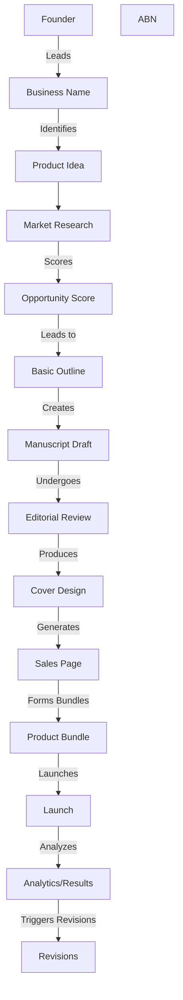

# APP Structure Diagram
## Fair Dinkum Publishing Agent Workforce

```mermaid
graph TD;
    A[Founder]
    B[Business Name]
    C[ABN]
    D[Product Idea]
    E[Market Research]
    F[Opportunity Score]
    G[Basic Outline]
    H[Manuscript Draft]
    I[Editorial Review]
    J[Cover Design]
    K[Sales Page]
    L[Product Bundle]
    M[Launch]
    N[Analytics/Results]
    O[Revisions]

    A -->|Leads| B;
    B -->|Identifies| D;
    D --> E;
    E -->|Scores| F;
    F -->|Leads to| G;
    G -->|Creates| H;
    H -->|Undergoes| I;
    I -->|Produces| J;
    J -->|Generates| K;
    K -->|Forms Bundles| L;
    L -->|Launches| M;
    M -->|Analyzes| N;
    N -->|Triggers Revisions| O;
```